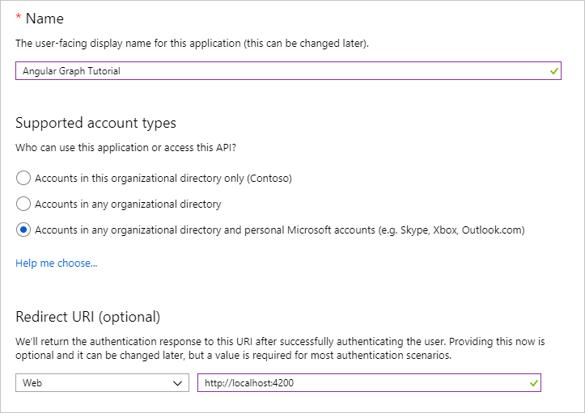

<!-- markdownlint-disable MD002 MD041 -->

在本练习中, 你将使用 Azure Active Directory 管理中心创建新的 Azure AD web 应用程序注册。

1. 打开浏览器，并转到 [Azure Active Directory 管理中心](https://aad.portal.azure.com)。 使用**个人帐户**（亦称为“Microsoft 帐户”）或**工作或学校帐户**登录。

1. 在左侧导航栏中选择 " **Azure Active Directory** ", 然后选择 "**管理**" 下的 "**应用程序注册**"。

    

1. 选择“新注册”****。 在“注册应用”**** 页上，按如下方式设置值。

    - 将“名称”**** 设置为“`Angular Graph Tutorial`”。
    - 将“受支持的帐户类型”**** 设置为“任何组织目录中的帐户和个人 Microsoft 帐户”****。
    - 在“重定向 URI”**** 下，将第一个下拉列表设置为“`Web`”，并将值设置为“`http://localhost:4200`”。

    

1. 选择 "**注册**"。 在 "**角度图" 教程**页上, 复制**应用程序 (客户端) ID**的值并保存它, 下一步将需要它。

    

1. 选择“管理”**** 下的“身份验证”****。 找到 "**隐式授予**" 部分并启用**访问令牌**和**ID 令牌**。 选择“保存”****。

    
