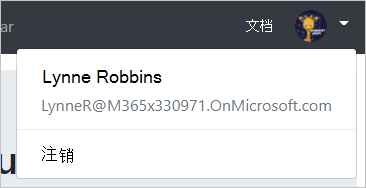

<!-- markdownlint-disable MD002 MD041 -->

在本练习中，你将扩展上一练习中的应用程序，以支持 Azure AD 的身份验证。 若要获取所需的 OAuth 访问令牌以调用 Microsoft Graph，这是必需的。 在此步骤中，将 [Microsoft 身份验证库的角度](https://github.com/AzureAD/microsoft-authentication-library-for-js/blob/dev/lib/msal-angular/README.md) 集成到应用程序中。

1. 在 **/src** 目录中创建一个名为 " **oauth.** " 的新文件，并添加以下代码。

    :::code language="typescript" source="../demo/graph-tutorial/src/oauth.example.ts":::

    将替换 `YOUR_APP_ID_HERE` 为应用程序注册门户中的应用程序 ID。

    > [!IMPORTANT]
    > 如果您使用的是源代码管理（如 git），现在可以从源代码管理中排除 **oauth** .aspx 文件，以避免无意中泄漏您的应用程序 ID。

1. 打开 **/src/app/app.module.ts** ，并将以下 `import` 语句添加到文件顶部。

    ```typescript
    import { MsalModule } from '@azure/msal-angular';
    import { OAuthSettings } from '../oauth';
    ```

1. 将添加 `MsalModule` 到声明中的 `imports` 数组 `@NgModule` ，并使用应用 ID 对它进行初始化。

    :::code language="typescript" source="../demo/graph-tutorial/src/app/app.module.ts" id="imports" highlight="6-11":::

## <a name="implement-sign-in"></a>实施登录

在本节中，您将创建一个身份验证服务，并实现登录和注销。

1. 在 CLI 中运行以下命令。

    ```Shell
    ng generate service auth
    ```

    通过为此创建服务，可以轻松地将其插入到任何需要访问身份验证方法的组件中。

1. 命令完成后，打开 **/src/app/auth.service.ts** 并将其内容替换为以下代码。

    ```typescript
    import { Injectable } from '@angular/core';
    import { MsalService } from '@azure/msal-angular';

    import { AlertsService } from './alerts.service';
    import { OAuthSettings } from '../oauth';
    import { User } from './user';

    @Injectable({
      providedIn: 'root'
    })

    export class AuthService {
      public authenticated: boolean;
      public user: User;

      constructor(
        private msalService: MsalService,
        private alertsService: AlertsService) {

        this.authenticated = false;
        this.user = null;
      }

      // Prompt the user to sign in and
      // grant consent to the requested permission scopes
      async signIn(): Promise<void> {
        let result = await this.msalService.loginPopup(OAuthSettings)
          .catch((reason) => {
            this.alertsService.addError('Login failed', JSON.stringify(reason, null, 2));
          });

        if (result) {
          this.authenticated = true;
          // Temporary placeholder
          this.user = new User();
          this.user.displayName = 'Adele Vance';
          this.user.email = 'AdeleV@contoso.com';
          this.user.avatar = '/assets/no-profile-photo.png';
        }
      }

      // Sign out
      signOut(): void {
        this.msalService.logout();
        this.user = null;
        this.authenticated = false;
      }

      // Silently request an access token
      async getAccessToken(): Promise<string> {
        let result = await this.msalService.acquireTokenSilent(OAuthSettings)
          .catch((reason) => {
            this.alertsService.addError('Get token failed', JSON.stringify(reason, null, 2));
          });

        if (result) {
          // Temporary to display token in an error box
          this.alertsService.addSuccess('Token acquired', result.accessToken);
          return result.accessToken;
        }

        // Couldn't get a token
        this.authenticated = false;
        return null;
      }
    }
    ```

1. 打开 **/src/app/nav-bar/nav-bar.component.ts** ，并将其内容替换为以下内容。

    :::code language="typescript" source="../demo/graph-tutorial/src/app/nav-bar/nav-bar.component.ts" id="navBarSnippet" highlight="3,15-22,24,26-28,36-38,40-42":::

1. 打开 **/src/app/home/home.component.ts** ，并将其内容替换为以下内容。

    :::code language="typescript" source="snippets/snippets.ts" id="homeSnippet" highlight="3,12-19,21,23,25-32":::

保存所做的更改并刷新浏览器。 单击 " **单击此处进行登录** " 按钮，您应被重定向到 `https://login.microsoftonline.com` 。 使用你的 Microsoft 帐户登录，并同意请求的权限。 应用程序页面应刷新，并显示令牌。

### <a name="get-user-details"></a>获取用户详细信息

现在，身份验证服务为用户的显示名称和电子邮件地址设置常量值。 现在，你已拥有访问令牌，可以从 Microsoft Graph 获取用户详细信息，以便这些值与当前用户相对应。

1. 打开 **/src/app/auth.service.ts** ，并将以下 `import` 语句添加到文件顶部。

    ```typescript
    import { Client } from '@microsoft/microsoft-graph-client';
    import * as MicrosoftGraph from '@microsoft/microsoft-graph-types';
    ```

1. 将新函数添加到称为 `AuthService` 的 `getUser` 类。

    :::code language="typescript" source="../demo/graph-tutorial/src/app/auth.service.ts" id="getUserSnippet":::

1. 在 `getAccessToken` 添加通知以显示访问令牌的方法中找到并删除以下代码。

    ```typescript
    // Temporary to display token in an error box
    this.alertsService.addSuccess('Token acquired', result);
    ```

1. 从方法中找到并删除以下代码 `signIn` 。

    ```typescript
    // Temporary placeholder
    this.user = new User();
    this.user.displayName = "Adele Vance";
    this.user.email = "AdeleV@contoso.com";
    this.user.avatar = '/assets/no-profile-photo.png';
    ```

1. 在其位置添加以下代码。

    ```typescript
    this.user = await this.getUser();
    ```

    此新代码使用 Microsoft Graph SDK 获取用户的详细信息，然后 `User` 使用 API 调用返回的值创建对象。

1. 更改 `constructor` 类的， `AuthService` 以检查用户是否已登录并加载其详细信息（如果这样做的话）。 将现有替换 `constructor` 为以下项。

    :::code language="typescript" source="../demo/graph-tutorial/src/app/auth.service.ts" id="constructorSnippet" highlight="5-6":::

1. 从类中删除临时代码 `HomeComponent` 。 打开 **/src/app/home/home.component.ts** ，并将现有 `signIn` 函数替换为以下项。

    :::code language="typescript" source="../demo/graph-tutorial/src/app/home/home.component.ts" id="signInSnippet":::

现在，如果您保存更改并启动应用程序，登录后应返回到主页，但 UI 应更改以指示您已登录。


单击右上角的用户头像以访问 " **注销** " 链接。 单击 " **注销** " 重置会话并返回到主页。



## <a name="storing-and-refreshing-tokens"></a>存储和刷新令牌

此时，您的应用程序具有访问令牌，该令牌是在 `Authorization` API 调用的标头中发送的。 这是允许应用代表用户访问 Microsoft Graph 的令牌。

但是，此令牌的生存期较短。 令牌在发出后会过期一小时。 由于应用程序使用的是 MSAL 库，因此您无需实现任何令牌存储或刷新逻辑。 将在 `MsalService` 浏览器存储中缓存令牌。 该 `acquireTokenSilent` 方法首先检查缓存的标记，如果它未过期，它将返回。 如果它已过期，则发出无提示请求以获取新的请求。
