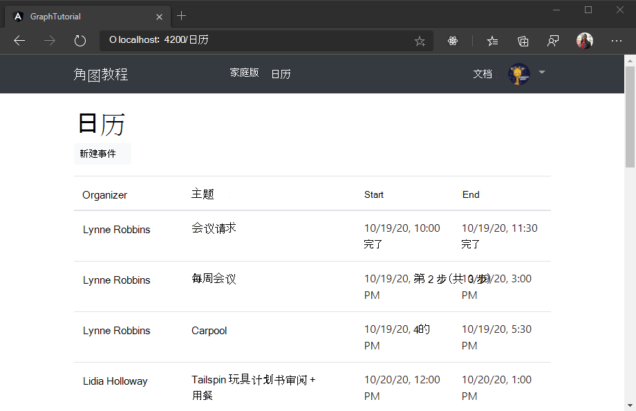

<!-- markdownlint-disable MD002 MD041 -->

<span data-ttu-id="f754f-101">在本练习中，将把 Microsoft Graph 合并到应用程序中。</span><span class="sxs-lookup"><span data-stu-id="f754f-101">In this exercise you will incorporate the Microsoft Graph into the application.</span></span> <span data-ttu-id="f754f-102">对于此应用程序，您将使用[microsoft graph 客户端](https://github.com/microsoftgraph/msgraph-sdk-javascript)库调用 microsoft graph。</span><span class="sxs-lookup"><span data-stu-id="f754f-102">For this application, you will use the [microsoft-graph-client](https://github.com/microsoftgraph/msgraph-sdk-javascript) library to make calls to Microsoft Graph.</span></span>

## <a name="get-calendar-events-from-outlook"></a><span data-ttu-id="f754f-103">从 Outlook 获取日历事件</span><span class="sxs-lookup"><span data-stu-id="f754f-103">Get calendar events from Outlook</span></span>

1. <span data-ttu-id="f754f-104">在`./src/app`目录中创建一个名`event.ts`为的新文件，并添加以下代码。</span><span class="sxs-lookup"><span data-stu-id="f754f-104">Create a new file in the `./src/app` directory called `event.ts` and add the following code.</span></span>

    :::code language="typescript" source="../demo/graph-tutorial/src/app/event.ts" id="eventClasses":::

1. <span data-ttu-id="f754f-105">添加新服务以包含所有图形呼叫。</span><span class="sxs-lookup"><span data-stu-id="f754f-105">Add a new service to hold all of your Graph calls.</span></span> <span data-ttu-id="f754f-106">在 CLI 中运行以下命令。</span><span class="sxs-lookup"><span data-stu-id="f754f-106">Run the following command in your CLI.</span></span>

    ```Shell
    ng generate service graph
    ```

    <span data-ttu-id="f754f-107">就像之前创建的身份验证服务一样，为此创建服务可让您将其插入到需要访问 Microsoft Graph 的任何组件中。</span><span class="sxs-lookup"><span data-stu-id="f754f-107">Just as with the authentication service you created earlier, creating a service for this allows you to inject it into any components that need access to Microsoft Graph.</span></span>

1. <span data-ttu-id="f754f-108">命令完成后，打开`./src/app/graph.service.ts`文件并将其内容替换为以下内容。</span><span class="sxs-lookup"><span data-stu-id="f754f-108">Once the command completes, open the `./src/app/graph.service.ts` file and replace its contents with the following.</span></span>

    :::code language="typescript" source="../demo/graph-tutorial/src/app/graph.service.ts" id="graphServiceSnippet":::

    <span data-ttu-id="f754f-109">考虑此代码执行的操作。</span><span class="sxs-lookup"><span data-stu-id="f754f-109">Consider what this code is doing.</span></span>

    - <span data-ttu-id="f754f-110">它在服务的构造函数中初始化 Graph 客户端。</span><span class="sxs-lookup"><span data-stu-id="f754f-110">It initializes a Graph client in the constructor for the service.</span></span>
    - <span data-ttu-id="f754f-111">它实现了`getEvents`通过以下方式使用 Graph 客户端的函数：</span><span class="sxs-lookup"><span data-stu-id="f754f-111">It implements a `getEvents` function that uses the Graph client in the following way:</span></span>
      - <span data-ttu-id="f754f-112">将调用的 URL 为`/me/events`。</span><span class="sxs-lookup"><span data-stu-id="f754f-112">The URL that will be called is `/me/events`.</span></span>
      - <span data-ttu-id="f754f-113">此`select`方法将为每个事件返回的字段限制为只是视图实际使用的字段。</span><span class="sxs-lookup"><span data-stu-id="f754f-113">The `select` method limits the fields returned for each events to just those the view will actually use.</span></span>
      - <span data-ttu-id="f754f-114">`orderby`方法按其创建日期和时间对结果进行排序，最新项目最先开始。</span><span class="sxs-lookup"><span data-stu-id="f754f-114">The `orderby` method sorts the results by the date and time they were created, with the most recent item being first.</span></span>

1. <span data-ttu-id="f754f-115">创建一个角度组件以调用此新方法并显示该调用的结果。</span><span class="sxs-lookup"><span data-stu-id="f754f-115">Create an Angular component to call this new method and display the results of the call.</span></span> <span data-ttu-id="f754f-116">在 CLI 中运行以下命令。</span><span class="sxs-lookup"><span data-stu-id="f754f-116">Run the following command in your CLI.</span></span>

    ```Shell
    ng generate component calendar
    ```

1. <span data-ttu-id="f754f-117">命令完成后，将组件添加到中`routes` `./src/app/app-routing.module.ts`的阵列。</span><span class="sxs-lookup"><span data-stu-id="f754f-117">Once the command completes, add the component to the `routes` array in `./src/app/app-routing.module.ts`.</span></span>

    ```TypeScript
    import { CalendarComponent } from './calendar/calendar.component';

    const routes: Routes = [
      { path: '', component: HomeComponent },
      { path: 'calendar', component: CalendarComponent }
    ];
    ```

1. <span data-ttu-id="f754f-118">打开`./src/app/calendar/calendar.component.ts`文件，并将其内容替换为以下内容。</span><span class="sxs-lookup"><span data-stu-id="f754f-118">Open the `./src/app/calendar/calendar.component.ts` file and replace its contents with the following.</span></span>

    ```TypeScript
    import { Component, OnInit } from '@angular/core';
    import * as moment from 'moment-timezone';

    import { GraphService } from '../graph.service';
    import { Event, DateTimeTimeZone } from '../event';
    import { AlertsService } from '../alerts.service';

    @Component({
      selector: 'app-calendar',
      templateUrl: './calendar.component.html',
      styleUrls: ['./calendar.component.css']
    })
    export class CalendarComponent implements OnInit {

      public events: Event[];

      constructor(
        private graphService: GraphService,
        private alertsService: AlertsService) { }

      ngOnInit() {
        this.graphService.getEvents()
          .then((events) => {
            this.events = events;
            // Temporary to display raw results
            this.alertsService.add('Events from Graph', JSON.stringify(events, null, 2));
          });
      }
    }
    ```

<span data-ttu-id="f754f-119">现在，这只是在页面上呈现 JSON 中的事件数组。</span><span class="sxs-lookup"><span data-stu-id="f754f-119">For now this just renders the array of events in JSON on the page.</span></span> <span data-ttu-id="f754f-120">保存更改并重新启动该应用。</span><span class="sxs-lookup"><span data-stu-id="f754f-120">Save your changes and restart the app.</span></span> <span data-ttu-id="f754f-121">登录并单击导航栏中的 "**日历**" 链接。</span><span class="sxs-lookup"><span data-stu-id="f754f-121">Sign in and click the **Calendar** link in the nav bar.</span></span> <span data-ttu-id="f754f-122">如果一切正常，应在用户的日历上看到一个 JSON 转储的事件。</span><span class="sxs-lookup"><span data-stu-id="f754f-122">If everything works, you should see a JSON dump of events on the user's calendar.</span></span>

## <a name="display-the-results"></a><span data-ttu-id="f754f-123">显示结果</span><span class="sxs-lookup"><span data-stu-id="f754f-123">Display the results</span></span>

<span data-ttu-id="f754f-124">现在，您可以更新`CalendarComponent`组件以以更用户友好的方式显示事件。</span><span class="sxs-lookup"><span data-stu-id="f754f-124">Now you can update the `CalendarComponent` component to display the events in a more user-friendly manner.</span></span>

1. <span data-ttu-id="f754f-125">从`ngOnInit`函数中移除添加警报的临时代码。</span><span class="sxs-lookup"><span data-stu-id="f754f-125">Remove the temporary code that adds an alert from the `ngOnInit` function.</span></span> <span data-ttu-id="f754f-126">更新的函数应如下所示。</span><span class="sxs-lookup"><span data-stu-id="f754f-126">Your updated function should look like this.</span></span>

    :::code language="typescript" source="../demo/graph-tutorial/src/app/calendar/calendar.component.ts" id="ngOnInitSnippet":::

1. <span data-ttu-id="f754f-127">向`CalendarComponent`类中添加函数，以将`DateTimeTimeZone`对象格式化为 ISO 字符串。</span><span class="sxs-lookup"><span data-stu-id="f754f-127">Add a function to the `CalendarComponent` class to format a `DateTimeTimeZone` object into an ISO string.</span></span>

    :::code language="typescript" source="../demo/graph-tutorial/src/app/calendar/calendar.component.ts" id="formatDateTimeTimeZoneSnippet":::

1. <span data-ttu-id="f754f-128">打开`./src/app/calendar/calendar.component.html`文件，并将其内容替换为以下内容。</span><span class="sxs-lookup"><span data-stu-id="f754f-128">Open the `./src/app/calendar/calendar.component.html` file and replace its contents with the following.</span></span>

    :::code language="html" source="../demo/graph-tutorial/src/app/calendar/calendar.component.html" id="calendarHtml":::

<span data-ttu-id="f754f-129">这将遍历事件集合并为每个事件添加一个表行。</span><span class="sxs-lookup"><span data-stu-id="f754f-129">This loops through the collection of events and adds a table row for each one.</span></span> <span data-ttu-id="f754f-130">保存所做的更改，然后重新启动应用程序。</span><span class="sxs-lookup"><span data-stu-id="f754f-130">Save the changes and restart the app.</span></span> <span data-ttu-id="f754f-131">单击 "**日历**" 链接，应用现在应呈现一个事件表。</span><span class="sxs-lookup"><span data-stu-id="f754f-131">Click on the **Calendar** link and the app should now render a table of events.</span></span>


