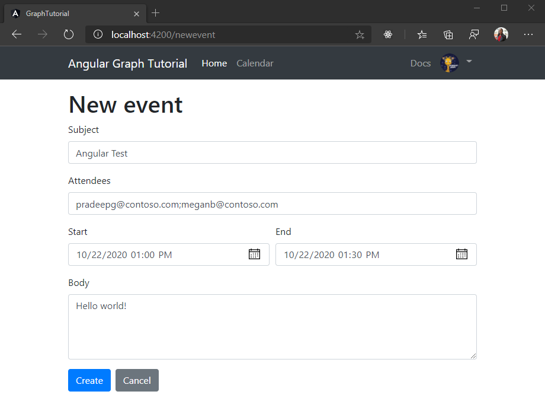

<!-- markdownlint-disable MD002 MD041 -->

在本节中，您将添加在用户日历上创建事件的功能。

1. 打开 **/src/app/graph.service.ts** ，并将以下函数添加到 `GraphService` 类中。

    :::code language="typescript" source="../demo/graph-tutorial/src/app/graph.service.ts" id="AddEventSnippet":::

## <a name="create-a-new-event-form"></a>创建新的事件表单

1. 创建一个角度组件以显示窗体并调用此新函数。 在 CLI 中运行以下命令。

    ```Shell
    ng generate component new-event
    ```

1. 命令完成后，将组件添加到 `routes` **/src/app/app-routing.module.ts**中的数组中。

    ```typescript
    import { NewEventComponent } from './new-event/new-event.component';

    const routes: Routes = [
      { path: '', component: HomeComponent },
      { path: 'calendar', component: CalendarComponent },
      { path: 'newevent', component: NewEventComponent },
    ];
    ```

1. 在名为**new**的 **/src/app/new-event**目录中创建一个新文件，并添加以下代码。

    :::code language="typescript" source="../demo/graph-tutorial/src/app/new-event/new-event.ts" id="NewEventSnippet":::

    此类将充当新事件窗体的模型。

1. 打开 **/src/app/new-event/new-event.component.ts** 并将其内容替换为以下代码。

    :::code language="typescript" source="../demo/graph-tutorial/src/app/new-event/new-event.component.ts" id="NewEventComponentSnippet":::

1. 打开 **/src/app/new-event/new-event.component.html** 并将其内容替换为以下代码。

    :::code language="html" source="../demo/graph-tutorial/src/app/new-event/new-event.component.html" id="NewEventFormSnippet":::

1. 保存更改并刷新应用。 在 "日历" 页上选择 " **新建事件** " 按钮，然后使用该窗体在用户日历上创建事件。

    
